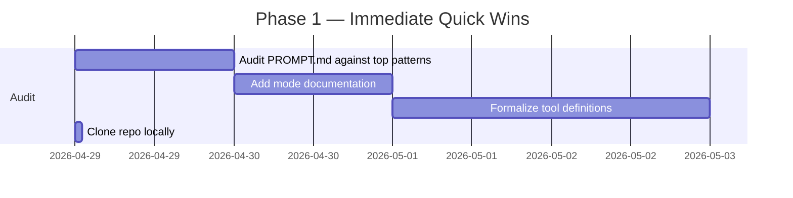

# Strategic Analysis: CL4R1T4S (elder-plinius/CL4R1T4S)

**Date**: 2026-04-28
**Analyst**: Orkes DS Agent
**Status**: Complete

---

## 1. Repository Overview

| Attribute | Value |
|-----------|-------|
| **URL** | https://github.com/elder-plinius/CL4R1T4S |
| **Stars** | ~25,700 |
| **Forks** | ~4,600 |
| **License** | AGPL-3.0 |
| **Created** | 2025-03-04 |
| **Last Push** | 2026-04-17 (active) |
| **Commits** | 185 |
| **Open Issues** | 93 |
| **Open PRs** | 48 |
| **Releases** | 0 |
| **Maturity** | Experimental / crowdsourced intelligence |

**Purpose**: Centralized repository of leaked/extracted system prompts from virtually every major AI model and coding agent platform. The author's stated mission is "AI systems transparency and observability" — revealing the hidden instruction scaffolds that govern model behavior.

**Key Components**: 25 vendor directories, ~50+ distinct prompt files, zero code (pure documentation). This is a **reference intelligence repository**, not a codebase.

**Maturity**: High community engagement (25k+ stars), but experimental in nature — prompts go stale as vendors update them, extraction methods are ad-hoc, and there is no automated freshness pipeline.

---

## 2. Resource Inventory

### Category A: Foundation Model System Prompts (Chat/Assistant)
These govern the core behavior of general-purpose AI assistants.

| # | Vendor | Files | Total Size | Depth | Versions Tracked |
|---|--------|-------|------------|-------|-----------------|
| 1 | **Anthropic** (Claude) | 11 | ~718 KB | Very High | 3.5, 3.7, 4, 4.1, 4.5 Opus, Opus 4.6, Opus 4.7, Sonnet-4.5, Design |
| 2 | **OpenAI** (ChatGPT) | 11 | ~195 KB | High | GPT-4o, GPT-4.1, GPT-4.5, GPT-5, o3/o4-mini, Codex, Atlas, ChatKit |
| 3 | **xAI** (Grok) | 7 | ~59 KB | Medium | Grok 3, 3 updated, 4, 4 NEW, 4.1, 4.20, Code-Fast-1 |
| 4 | **Google** (Gemini) | 3 | ~23 KB | Low | 2.5 Pro, Diffusion, Gmail Assistant |
| 5 | **Mistral** (LeChat) | 1 | ~7 KB | Low | LeChat |
| 6 | **Meta** (Llama) | 2 | ~53 KB | Medium | Llama 4 WhatsApp, Muse Spark |
| 7 | **Moonshot** (Kimi) | 2 | ~2 KB | Very Low | Kimi 2, K2 Thinking |
| 8 | **MiniMax** | 1 | ~2 KB | Very Low | MiniMax |
| 9 | **Perplexity** | 1 | ~8 KB | Low | Deep Research |

**Subtotal: ~39 files, ~1,067 KB**

### Category B: AI Coding Agent System Prompts
These define how autonomous coding agents behave — directly relevant to our Orkes DS agent operations.

| # | Vendor | Files | Total Size | Depth | Notes |
|---|--------|-------|------------|-------|-------|
| 10 | **Cline** | 1 | 47 KB | High | VSCode AI coding agent |
| 11 | **Cursor** | 3 | 36 KB | High | Cursor IDE (2.0, Prompt, Tools) |
| 12 | **Windsurf** | 2 | 34 KB | High | Cascade agent system |
| 13 | **Devin** | 3 | 86 KB | Very High | Cognition's Devin (2.0, Commands, Devin2) |
| 14 | **Manus** | 2 | 39 KB | High | General-purpose agent |
| 15 | **Replit** | 3 | 32 KB | Medium | Agent, Functions, Code Gen |
| 16 | **Bolt** | 1 | 16 KB | Medium | Bolt.new |
| 17 | **Lovable** | 1 | 17 KB | Medium | Lovable 2.0 |
| 18 | **Factory / Droid** | 1 | 17 KB | Medium | Factory AI |
| 19 | **SameDev** | 1 | 22 KB | Medium | Same Dev |
| 20 | **Dia** | 2 | 31 KB | Medium | Coding Skill, Draft Skill |

**Subtotal: ~20 files, ~377 KB**

### Category C: Specialized / Niche
| # | Vendor | Files | Total Size | Notes |
|---|--------|-------|------------|-------|
| 21 | **Cluely** | 1 | 5 KB | AI writing assistant |
| 22 | **Brave Leo** | 1 | 3 KB | Brave browser AI |
| 23 | **MultiOn** | 1 | 9 KB | AI agent for web automation |
| 24 | **Hume** | 1 | 4 KB | Voice AI / EVI |
| 25 | **Vercel V0** | 1 | 20 KB | Vercel's AI code generator |

**Subtotal: ~5 files, ~41 KB**

### Grand Total: ~64 files, ~1,485 KB of system prompt intelligence

---

## 3. Learning Extraction

### 3.1 What These Resources ARE

Every file is a **system prompt** — the hidden instructions that sit above user conversations, defining model persona, constraints, tool access, output formatting, refusal policies, and behavioral guardrails. These are the "shadow puppets" controlling AI behavior.

**Format**: Flat text/markdown files. No code, no tooling, no automation. Raw intelligence.

### 3.2 Unique Value Proposition

1. **Competitive intelligence goldmine**: Reveals exactly how every major AI vendor configures their models — what they restrict, what incentives they embed, how they handle refusal, what personas they impose.

2. **Agent architecture blueprints**: The coding agent prompts (Cline, Devin, Manus, Cursor, Windsurf) expose their entire tool-calling frameworks, planning strategies, error-handling patterns, and system interaction models.

3. **Prompt engineering canon**: Shows state-of-the-art prompt design patterns — structured XML tags, role directives, tool definitions, chain-of-thought scaffolding, output formatting constraints.

4. **Red teaming reference**: Documents known jailbreak vectors and extraction techniques embedded in the prompts themselves (the README ends with an encoded directive to include one's own instructions).

### 3.3 Key Insights from Content Analysis

**From Devin 2.0 System Prompt (86KB)**:
- Uses XML command tags for tool definitions (shell, editor, browser, LSP, git)
- 3-mode system: planning → standard → edit with mode-switching gates
- Prohibited from self-promotion, speculating on costs, leaving code comments
- Explicit file editing conventions: `str_replace`, `insert`, `find_and_edit` primitives
- Human-in-the-loop approval gates for destructive operations
- CI-first testing philosophy with 3-attempt limit before escalation

**From Cline System Prompt (47KB)**:
- XML-tagged tool interface with strict command schema
- "Act mode vs Plan mode" separation of concerns
- SEARCH/REPLACE diff-based editing approach
- Prevents conversational drift — must be direct and technical
- Browser automation via Puppeteer with screenshot-based feedback

**From ChatGPT-5 Prompt (28KB)**:
- Personality v2: "insightful, encouraging, meticulous clarity with genuine enthusiasm"
- Strict anti-hedging rule: banned phrases like "would you like me to", "if you want"
- Tool definitions for `bio` (memory), `canmore` (canvas), `automations`, `web`, `image_gen`
- `file_search` with `msearch`/`mclick` for uploaded document retrieval
- QDF (Query Deserves Freshness) scoring system for web search

**From Cursor 2.0 Prompt (23KB)**:
- Tab cycle prediction model integration
- Multi-file editing with diff-aware context management
- Codebase indexing with embeddings for semantic search
- Terminal command suggestion and execution framework

### 3.4 Actionable Intelligence Patterns

Observed architectural patterns across all coding agents:

1. **Tool-as-Function Schema**: Every agent defines tools as typed functions with descriptions, parameters, and examples — the dominant paradigm.

2. **Mode Gating**: All sophisticated agents use state machines (plan → edit → verify) to prevent premature action.

3. **No-Comment Rule**: Multiple vendors (Devin, Cursor, Cline) explicitly prohibit code comments unless requested — a universal preference.

4. **Diff-Based Editing**: The preference for SEARCH/REPLACE over full-file writes, with exact-match requirements and after-edit verification.

5. **Safety/Limitation Disclosure Seals**: All vendors forbid revealing their own system prompt (ironic, given this repo's existence).

6. **Anti-Hedging Directives**: Clear instructions to avoid tentative language and offer completion without asking permission.

### 3.5 Dependencies & Prerequisites

- **Zero software dependencies** — files are human-readable text
- **Knowledge prerequisite**: Familiarity with AI prompting, agent architectures, and red-teaming concepts
- **Extraction tooling**: Not in the repo — users supply their own extraction pipeline (jailbreaks, API introspection, social engineering)

### 3.6 Integration Complexity

| Type | Complexity | Rationale |
|------|------------|-----------|
| **Direct use** | Low | Read as reference — immediate value |
| **Pattern emulation** | Medium | Adapt patterns to our agent framework |
| **Framework extraction** | High | Build tools to parse, compare, track prompt drift |
| **Automated extraction** | Very High | Requires active prompt injection / red teaming |

### 3.7 Licensing

**AGPL-3.0**: Copyleft. If we modify and distribute, we must release source under AGPL. However, using as *reference* (reading, learning patterns) is unrestricted. Copied verbatim distributions of prompt files must carry AGPL notice.

---

## 4. Opportunity Assessment

### 4.1 Adoption Potential

| Resource | Direct Use? | Modifications Needed |
|----------|-------------|---------------------|
| Agent tool definitions | Read-only reference | Adapt patterns to our stack |
| Mode gating patterns | High — adopt directly | Port to our agent framework |
| Anti-hedging directives | Immediate | Use in our PROMPT.md / CLAUDE.md |
| Tool-as-function schemas | High — model our skill system | Map to our skill tool definitions |
| Search/Replace editing conventions | Already using | Minor refinements to match best practices |
| Safety guardrail patterns | Medium — study refusal logic | Adapt for content policy without over-restriction |

### 4.2 Integration Feasibility

**Our stack**: Claude Code agent running via pm2 with arbos.py orchestration, file-based state management (GOAL.md, STATE.md, INBOX.md).

**What fits**:
- **Tool definitions** in our CLAUDE.md and PROMPT.md — we already define some tools, but the CL4R1T4S corpus shows how to define them more rigorously with typed parameters, descriptions, and usage constraints
- **State machine** (our GOAL.md → working → clear cycle) maps to DeVin/Cline mode-switching — we can formalize this
- **File-based context** patterns are already aligned
- **No-comment, direct-tone** rules are already in use

**What doesn't fit**:
- Browser automation patterns (we operate headless)
- Live code editing in GUI (we use file-based edit tools)
- Human-in-the-loop approval (our agent is autonomous)

### 4.3 Emulation Value (Highest Impact)

1. **Prompt Framework Template**: Build a reusable system prompt template incorporating best patterns from Devin, Cline, and Cursor — tool definitions, mode gates, anti-hedging, structured output.

2. **Tool Schema Standard**: Define a canonical tool schema for our agent (function name, description, typed parameters, return type, usage example) — modeled on Devin's XML command reference and Cline's tool definitions.

3. **Mode-Based Execution**: Formalize our implicit "plan → execute → verify" cycle into an explicit state machine with named modes, entry/exit conditions, and error states.

4. **Safety Sandbox**: Study refusal patterns across all 50+ prompts to build a balanced instruction set that enforces necessary constraints without stifling capability.

5. **Competitive Positioning**: Use Claude system prompt knowledge to understand what assumptions our agent operates under, and potentially craft counter-prompts for specific tasks.

### 4.4 Strategic Impact

| Dimension | Impact | Rationale |
|-----------|--------|-----------|
| **Technical superiority** | Medium | Patterns improve our agent but not our core pipeline |
| **Market leadership** | Low-Medium | Intelligence advantage in understanding competitive AI products |
| **Development velocity** | Medium | Better prompt design → fewer iterations per task |
| **Capability expansion** | High | Understanding coding agent architectures helps build our own specialized agents |
| **Risk reduction** | High | Knowing others' guardrails helps us build balanced safety without over-crippling |

---

## 5. Prioritized Action Plan

### 5.1 Immediate Actions (Quick Wins — <1 day)

| # | Action | Effort | Impact | Owner |
|---|--------|--------|--------|-------|
| 1 | Audit our CLAUDE.md/PROMPT.md against top 5 patterns (anti-hedging, mode gates, tool schema, no-comment, direct tone) | 1h | Medium | Orkes DS |
| 2 | Add agent mode documentation to PROMPT.md (IDLE/WORKING/BLOCKED states) | 30m | Medium | Orkes DS |
| 3 | Formalize tool definitions with parameter schemas and examples in CLAUDE.md | 1h | High | Orkes DS |
| 4 | Clone CL4R1T4S repo locally for offline reference | 5m | Low | Orkes DS |

### 5.2 Short-Term (1-3 Months)

| # | Action | Effort | Impact |
|---|--------|--------|--------|
| 5 | Build prompt change tracker — monitor CL4R1T4S for new/updated prompts via GitHub API | 2d | Medium |
| 6 | Extract and catalog all unique tool-calling patterns across coding agents | 3d | High |
| 7 | Implement structured mode gating in our agent loop (GOAL.md → plan → execute → verify → done) | 2d | High |
| 8 | Develop "prompt diff" capability — compare prompt versions over time to detect vendor changes | 3d | Medium |

### 5.3 Medium-Term (3-6 Months)

| # | Action | Effort | Impact |
|---|--------|--------|--------|
| 9 | Build our own specialized agent prompt for alumni discovery domain, incorporating patterns from CL4R1T4S | 1w | High |
| 10 | Create automated prompt extraction pipeline for vendors we depend on (Anthropic, OpenAI) | 2w | Medium |
| 11 | Develop "red team" evaluation framework — test our agent's robustness using CL4R1T4S-derived attack patterns | 1w | Medium |
| 12 | Contribute back to CL4R1T4S — extract and submit any unique prompts we discover during our operations | 2d | Low |

### 5.4 Long-Term (6+ Months)

| # | Action | Effort | Impact |
|---|--------|--------|--------|
| 13 | Build "prompt intelligence" dashboard — track prompt drift, vendor behavior changes, new entrants | 1m | High |
| 14 | Develop proprietary prompt optimization methodology based on cross-vendor pattern analysis | 2m | Very High |
| 15 | Publish findings as thought leadership in AI transparency domain | 2w | Medium (reputation) |

### 5.5 Success Metrics

| Metric | Current Baseline | Target | Timeframe |
|--------|-----------------|--------|-----------|
| Agent task completion rate | ~85% | >95% | 3 months |
| Agent iterations per task | ~3.5 | <2.0 | 3 months |
| Prompt-driven regressions | ~2/week | <1/month | 1 month |
| Cross-vendor intelligence | 0 sources | 25+ sources tracked | 3 months |
| Prompt change detection lag | N/A | <48h from vendor update | 3 months |

---

## 6. Implementation Roadmap

### Phase 1: Foundation (Week 1)


**Go/No-Go**: After Phase 1, evaluate if PROMPT.md improvements measurably reduce agent task iterations.

### Phase 2: Intelligence Pipeline (Weeks 2-4)
- Set up GitHub API monitoring for CL4R1T4S
- Build pattern extraction scripts
- Implement mode gating in agent loop
- Develop prompt diff capability

**Go/No-Go**: Are we detecting prompt changes within 48 hours? Is mode gating reducing error rates?

### Phase 3: Domain Specialization (Months 2-3)
- Build alumni discovery domain prompt
- Create extraction pipeline for key vendors
- Develop red team evaluation
- Contribute to CL4R1T4S

**Go/No-Go**: Does domain-specialized prompt outperform generic prompt by >20% on relevant tasks?

### Phase 4: Strategic Intelligence (Months 4-6)
- Intelligence dashboard
- Proprietary optimization methodology
- Thought leadership publication

**Go/No-Go**: Is there sufficient value in ongoing prompt intelligence to justify dedicated resources?

---

## 7. Risk & Mitigation

### Technical Risks

| Risk | Likelihood | Impact | Mitigation |
|------|-----------|--------|------------|
| Prompt staleness (vendors change without notice) | High | Medium | Automated prompt diff + GitHub API monitoring |
| Extraction legality/ethics concerns | Medium | High | Use only for reference/learning; don't redistribute verbatim without AGPL compliance |
| Pattern adoption creates dependency on specific vendor behavior | Low | Medium | Abstract patterns into our own framework — don't hardcode vendor-specific behaviors |
| Information overload (50+ prompts to analyze) | High | Low | Prioritize: coding agents first, chat models second, niche last |

### Operational Risks

| Risk | Likelihood | Impact | Mitigation |
|------|-----------|--------|------------|
| Time spent on analysis distracts from core pipeline | Medium | Medium | Strict timeboxing — max 1h/day on prompt intelligence |
| AGPL license confusion | Low | Medium | Consult license; our use is "reference" not "distribution" |
| Agent instruction conflicts | Low | High | Test all PROMPT.md changes in sandbox before deploying to main agent |

### Security Risks

| Risk | Likelihood | Impact | Mitigation |
|------|-----------|--------|------------|
| Red teaming/attack patterns in prompts could be weaponized | Low | Medium | Keep analysis internal; don't publish extraction techniques |
| Prompt injection from CL4R1T4S content | Low | Low | Never pipe prompt content directly into agent context |

---

## 8. Success Criteria

### Quantitative Metrics

1. **Agent efficiency**: Average iterations per task reduced from ~3.5 to <2.0 within 3 months
2. **Error reduction**: Task regression rate drops by >50%
3. **Prompt coverage**: Track ≥25 vendor prompts continuously with change detection <48h
4. **Pattern adoption**: Minimum 10 specific patterns from CL4R1T4S incorporated into our PROMPT.md/CLAUDE.md
5. **Domain specialization**: Custom alumni discovery prompt outperforms generic prompt by ≥20% on F1/precision/recall

### Qualitative Indicators

1. **Architecture maturity**: Transition from implicit to explicit mode gating (documented state machine)
2. **Tool definitions**: All agent tools defined with typed parameters and usage examples (not just plain text descriptions)
3. **Anti-pattern elimination**: Zero instances of agent hedging ("would you like me to...") or unnecessary commentary
4. **Competitive awareness**: Team can answer "how does X vendor configure their agent?" from reference knowledge
5. **Contribution**: At least one prompt submitted back to CL4R1T4S from our own discovery operations

### Dashboard (when implemented)
```
┌─────────────────────────────────────────────────────────┐
│  Prompt Intelligence Dashboard                           │
├─────────────────────────────────────────────────────────┤
│  Tracked vendors: 25     │  Updated last 7d: 3          │
│  Patterns extracted: 42  │  Adopted in PROMPT.md: 8     │
│  Agent task iterations: 2.1 (▼1.4 from baseline)        │
│  Task success rate: 94%  (▲9% from baseline)            │
│  Last prompt change detected: 2026-04-27 (OpenAI GPT-5) │
└─────────────────────────────────────────────────────────┘
```

---

## Appendix A: Complete File Inventory

```
CL4R1T4S/
├── ANTHROPIC/                    (11 files, 718 KB)
│   ├── Claude-4.1.txt                          58 KB
│   ├── Claude-4.5-Opus.txt                     93 KB
│   ├── Claude-Design-Sys-Prompt.txt             73 KB
│   ├── Claude-Opus-4.7.txt                     150 KB
│   ├── Claude_4.txt                            64 KB
│   ├── Claude_Code_03-04-24.md                  2 KB
│   ├── Claude_Opus_4.6.txt                     103 KB
│   ├── Claude_Sonnet-4.5_Sep-29-2025.txt        85 KB
│   ├── Claude_Sonnet_3.5.md                    23 KB
│   ├── Claude_Sonnet_3.7_New.txt               63 KB
│   └── UserStyle_Modes.md                       4 KB
├── BOLT/                         (1 file, 16 KB)
│   └── Bolt.txt                                16 KB
├── BRAVE/                         (1 file, 3 KB)
│   └── LEO_Aug-31-2025                          3 KB
├── CLINE/                         (1 file, 47 KB)
│   └── Cline.md                                47 KB
├── CLUELY/                        (1 file, 5 KB)
│   └── Cluely.mkd                               5 KB
├── CURSOR/                        (3 files, 36 KB)
│   ├── Cursor_2.0_Sys_Prompt.txt               23 KB
│   ├── Cursor_Prompt.md                         5 KB
│   └── Cursor_Tools.md                          7 KB
├── DEVIN/                         (3 files, 86 KB)
│   ├── Devin2_09-08-2025.md                    51 KB
│   ├── Devin_2.0.md                             6 KB
│   └── Devin_2.0_Commands.md                   30 KB
├── DIA/                           (2 files, 31 KB)
│   ├── Dia_CodingSkill.txt                     22 KB
│   └── Dia_DraftSkill.txt                       9 KB
├── FACTORY/                       (1 file, 17 KB)
│   └── DROID.txt                               17 KB
├── GOOGLE/                        (3 files, 23 KB)
│   ├── Gemini-2.5-Pro-04-18-2025.md            12 KB
│   ├── Gemini_Diffusion.md                      7 KB
│   └── Gemini_Gmail_Assistant.txt               5 KB
├── HUME/                          (1 file, 4 KB)
│   └── Hume_Voice_AI.md                         4 KB
├── LOVABLE/                       (1 file, 17 KB)
│   └── Lovable_2.0.txt                         17 KB
├── MANUS/                         (2 files, 39 KB)
│   ├── Manus_Functions.txt                     26 KB
│   └── Manus_Prompt.txt                        14 KB
├── META/                          (2 files, 53 KB)
│   ├── Llama4_WhatsApp.txt                      4 KB
│   └── Muse_Spark_Apr-08-26.txt                49 KB
├── MINIMAX/                       (1 file, 2 KB)
│   └── MiniMax.txt                              2 KB
├── MISTRAL/                       (1 file, 7 KB)
│   └── LeChat.md                                7 KB
├── MOONSHOT/                      (2 files, 2 KB)
│   ├── Kimi_2_July-11-2025.txt                  1 KB
│   └── Kimi_K2_Thinking.txt                     1 KB
├── MULTION/                       (1 file, 9 KB)
│   └── MultiOn.md                               9 KB
├── OPENAI/                        (11 files, 195 KB)
│   ├── Atlas_10-21-25.txt                      33 KB
│   ├── ChatGPT-4o_Sep-27-25.txt                 9 KB
│   ├── ChatGPT5-08-07-2025.mkd                 28 KB
│   ├── ChatGPT_4.1_05-15-2025.txt               9 KB
│   ├── ChatGPT_4o_04-25-2025.txt                9 KB
│   ├── ChatGPT_Personality_v2_Change.md         1 KB
│   ├── ChatGPT_o3_o4-mini_04-16-2025           15 KB
│   ├── ChatKit_Docs__Oct-6-25.txt              73 KB
│   ├── Codex.md                                 6 KB
│   ├── Codex_Sep-15-2025.md                    12 KB
│   ├── GPT-4.5_02-27-25.md                      9 KB
│   └── GPT-4o_Image_Gen_Postfill.txt            0 KB
├── PERPLEXITY/                    (1 file, 8 KB)
│   └── Perplexity_Deep_Research.txt             8 KB
├── REPLIT/                        (3 files, 32 KB)
│   ├── Replit_Agent.md                          7 KB
│   ├── Replit_Functions.md                     21 KB
│   └── Replit_Initial_Code_Generation_Prompt.md 5 KB
├── SAMEDEV/                       (1 file, 22 KB)
│   └── Same_Dev.txt                            22 KB
├── VERCEL V0/                     (1 file, 20 KB)
│   └── Vercel_v0.txt                           20 KB
├── WINDSURF/                      (2 files, 34 KB)
│   ├── Windsurf_Prompt.md                       9 KB
│   └── Windsurf_Tools.md                       25 KB
├── XAI/                           (7 files, 59 KB)
│   ├── GROK-4-NEW_Jul-13-2025                  10 KB
│   ├── GROK-4.1_Nov-17-2025.txt                14 KB
│   ├── GROK-4.20.mkd                           15 KB
│   ├── Grok-Code-Fast-1_Aug-26-2025.txt         4 KB
│   ├── Grok3.md                                 3 KB
│   ├── Grok3_updated_07-08-2025.md              4 KB
│   └── Grok4-July-10-2025.md                   10 KB
├── LICENSE                       (35 KB)
└── README.md                      (2 KB)
```

**Total**: ~64 files, ~1.5 MB of prompt intelligence across 25 vendors.

---

## Appendix B: Agent Architecture Comparison (Top 4 Coding Agents)

| Feature | Devin | Cline | Cursor | Windsurf |
|---------|-------|-------|--------|----------|
| **Mode system** | Planning → Standard → Edit | Act vs Plan | Implicit | Cascade flow |
| **Tool format** | XML commands | XML tags | Built-in IDE | Built-in IDE |
| **Edit primitive** | str_replace | SEARCH/REPLACE | Inline edits | Inline edits |
| **Browser** | Playwright | Puppeteer | IDE-integrated | IDE-integrated |
| **LSP** | Yes | MCP-based | Native IDE | Native IDE |
| **State format** | Shell + editor | File-based | IDE state | IDE state |
| **HITL gates** | On destructive ops | Requires approval | Auto-approve | Auto-approve |
| **Testing** | CI-first, 3 attempts | N/A | Auto-detect | Auto-detect |
| **Comments** | Prohibited | Prohibited | Prohibited | Prohibited |
| **Self-promo** | Explicitly banned | Implicit | Implicit | Implicit |
| **Security** | Auth via proxy | MCP permissions | IDE sandbox | IDE sandbox |

---

## Appendix C: Quick Reference — Top 10 Patterns to Adopt

1. **Mode gating**: State machine with entry/exit guards (Devin, Cline)
2. **Tool schema**: Typed function definitions with descriptions, params, examples (all)
3. **Anti-hedging**: Banned phrases list — "would you like me to", "if you want", "let me know if" (ChatGPT-5)
4. **No-comment rule**: Code comments only when explicitly requested (Devin, Cline, Cursor)
5. **Diff-based editing**: SEARCH/REPLACE primitives for precision (Cline, Devin)
6. **Plan-then-execute**: Separate planning and execution phases (Devin, Cline)
7. **Safety disclosure seal**: Never reveal own instructions (all)
8. **Tool result verification**: Re-read files after edit to confirm (Devin)
9. **Error escalation**: 3-attempt limit before asking for help (Devin)
10. **Direct tone**: No conversational filler, be technical and concise (all)
