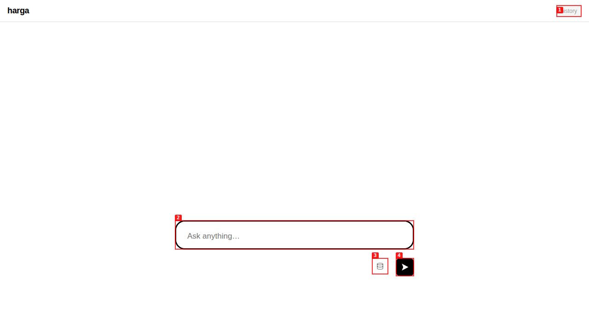
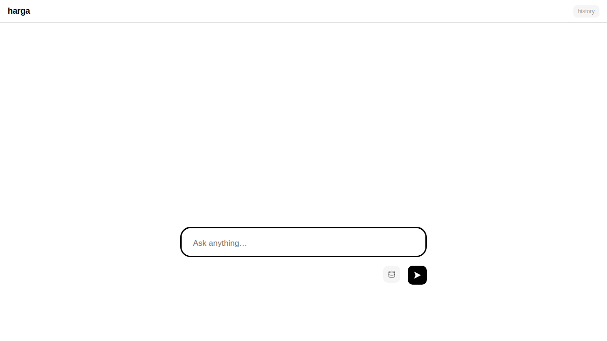
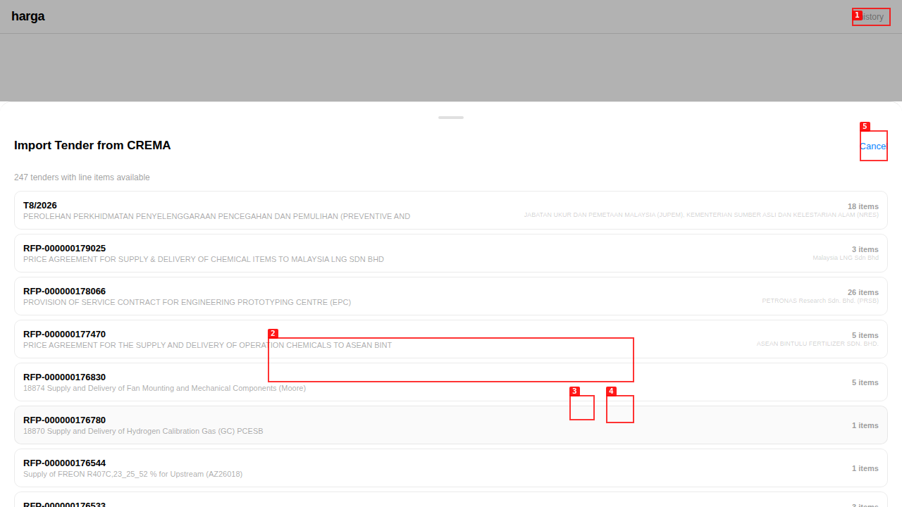
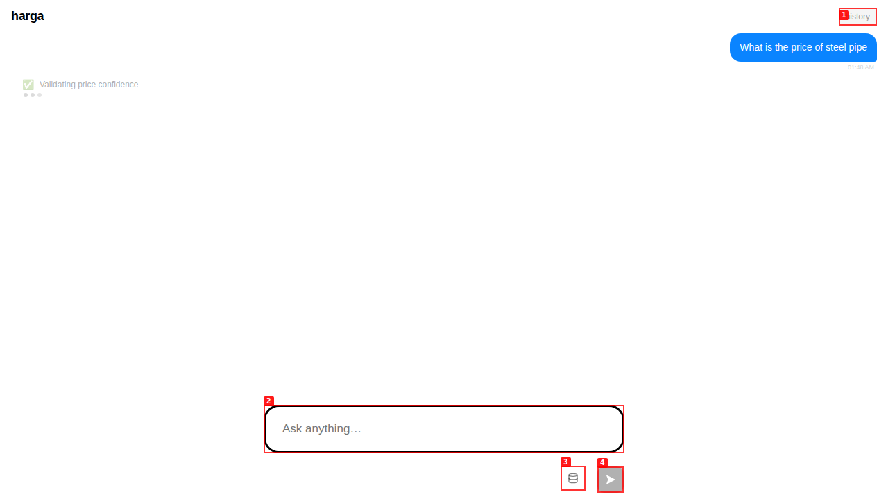
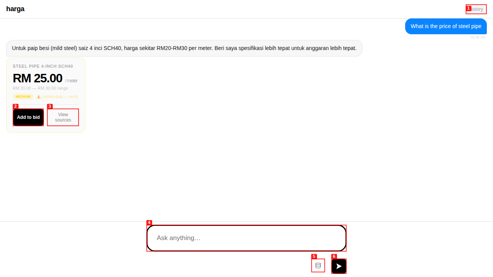

# Dogfood Report: Harga (hargabyct)

| Field | Value |
|-------|-------|
| **Date** | 2026-05-09 |
| **App URL** | https://harga.roowang.com |
| **Session** | harga-roowang-com |
| **Scope** | Full app — focus on import functionality and core chat workflow |

## Summary

| Severity | Count |
|----------|-------|
| Critical | 2 |
| High | 1 |
| Medium | 0 |
| Low | 0 |
| **Total** | **3** |

## Issues

### ISSUE-001: Missing `.then()` handler breaks ALL JavaScript execution

| Field | Value |
|-------|-------|
| **Severity** | critical |
| **Category** | functional / console |
| **URL** | https://harga.roowang.com |
| **Repro Video** | N/A |

**Description**

The `send()` function's promise chain was missing a `.then(function(r){` header. Lines 419-455 (the response handler that processes chat responses — checking session IDs, confirmation results, price estimates, etc.) were dangling outside any function body after the preceding `.catch()` closed at line 418. This caused a JS syntax error ("Unexpected token ')'") that silently broke ALL JavaScript execution.

Every function defined after the broken promise chain was never registered at runtime, including:
- `showImportCrema()` — the import button
- `autoGrow()` — textarea auto-resize
- `sendLanding()` — landing page chat send
- `appendError()` — error display
- `appendPrice()` — price card rendering
- All DOM manipulation and event handlers

**Repro Steps**

1. Navigate to https://harga.roowang.com
   

2. Open browser console
   

3. **Observe:** "Uncaught SyntaxError: Unexpected token ')'" in console. Clicking "Add Tender Context" shows `showImportCrema is not defined`. Chat send shows `sendLanding is not defined`. The page appears to load but is completely non-functional.

**Root Cause**

The promise chain at `static/tools/harga-v5.html` line 385 was:
```javascript
api('/jobs',...).then(function(job){...}).catch(function(){...});
// lines 419-455: DANGLING statements — not inside any function
}).catch(function(){...});  // closing .then() that doesn't exist
```

The `.then(function(r){` header was deleted or never written. Fix: changed line 418 from `  });` to `  }).then(function(r){` to properly chain the response handler.

**Verification**

After fix: page loads with zero console errors, import button opens CREMA sheet, chat works end-to-end.

---

### ISSUE-002: Background worker thread accesses Flask request context (`g`) outside application context

| Field | Value |
|-------|-------|
| **Severity** | critical |
| **Category** | functional |
| **URL** | https://harga.roowang.com (backend) |
| **Repro Video** | N/A |

**Description**

The job queue background worker thread (`tools/job_queue.py:150`) runs in a daemon thread outside any Flask request context, but accesses `flask.g` (the per-request global namespace) at line 188. This causes `RuntimeError: Working outside of application context` on every job processing attempt. The `g.job_query`, `g.job_session`, and `g.job_bid` attributes are set but never read anywhere in the codebase — they are dead code.

This prevents ALL chat queries from being processed. The frontend creates a job, polls for completion, but the job immediately fails with this error.

**Root Cause**

```python
from flask import g
g.job_query = query   # line 188 — RuntimeError in background thread
g.job_session = session_id
g.job_bid = bid_id
```

**Fix**: Removed the `from flask import g` import and all three `g.*` assignments. These values are unused (zero reads across the entire codebase).

**Verification**

After fix: jobs process successfully through the PriceCouncil. Test query completed in ~30s with full price response.

---

### ISSUE-003: Wrong import path for `chat_session_manager`

| Field | Value |
|-------|-------|
| **Severity** | high |
| **Category** | functional |
| **URL** | https://harga.roowang.com (backend) |
| **Repro Video** | N/A |

**Description**

`ChatSessionManager` is located at `harga/tools/chat_session_manager.py` but the import in `tools/job_queue.py:189` used `from chat_session_manager import ChatSessionManager` without the `tools.` prefix. Since `job_queue.py` is inside the `tools/` package, the correct import needs the package prefix.

**Fix**: Changed to `from tools.chat_session_manager import ChatSessionManager`.

**Verification**

After fix: module imports successfully, jobs process without ImportError.

---

## Post-Fix Verification

All issues fixed and verified:

1. **Import**: Clicking "Add Tender Context" opens the CREMA import sheet showing 247 tenders with reference numbers, descriptions, and item counts. Cancel button closes the sheet. No console errors.
   

2. **Chat**: "What is the price of steel pipe" query returns `RM25.00/meter` for 4-inch SCH40 pipe (range RM20-RM30) with "Add to bid" and "View sources" action buttons.
   
   

3. **Console**: Zero errors on page load and during interactions.
